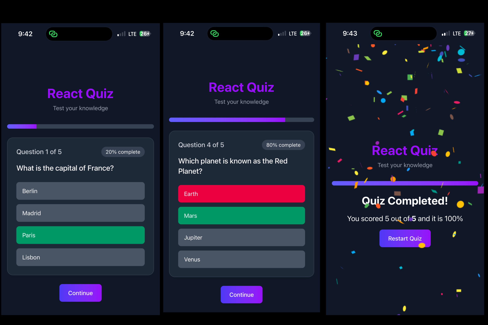
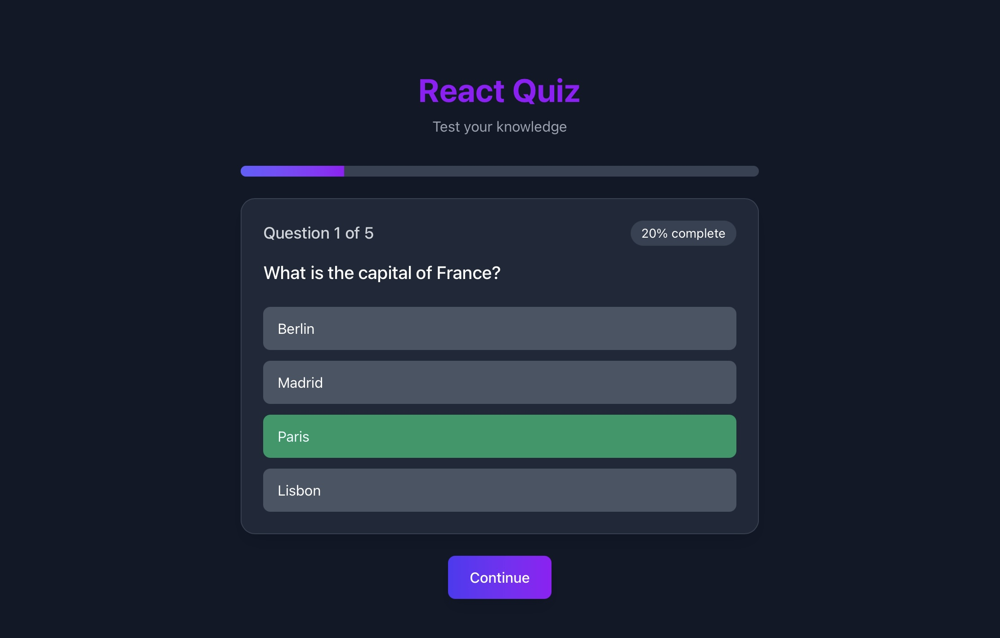
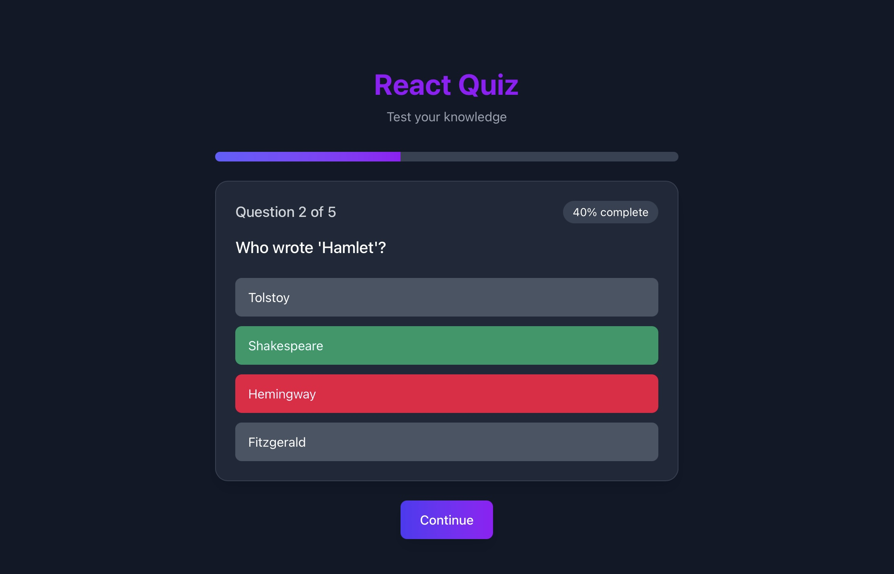

# 🧠 **QUIZ APP – Interactive Learning Game**

A sleek and modern **React + Vite**-powered **quiz application** built for engaging and fun learning experiences.  
**Quiz App** allows users to test their knowledge through interactive questions, view their scores instantly, and celebrate success with **Confetti animations** ,all styled beautifully using **Tailwind CSS** for a clean and responsive UI.

**Note:** This project focuses on frontend functionality; quizzes and questions are loaded from a **local JavaScript file** acting as dummy data.

---

## 🖼️ **Screenshots**

## 🖼️ **Mobile Pages**

## 🖼️ **Desktop layout**

  

---

## 🧰 **Tech Stack**

This project was built using the following technologies and tools:

### ⚛️ **Core Framework**

- **[React](https://react.dev/)** – Core library for building the interactive quiz interface
- **[Vite](https://vitejs.dev/)** – Lightning-fast development environment and build tool for modern React apps

### 🧩 **State Management & Data**

- **React Hooks** – Utilizes **`useState`** and **`useEffect`** for handling quiz logic, tracking user answers, and managing app state dynamically
- **Local Data File** – All questions and answers are imported from a **dummy JavaScript file** located within the project

### 🎨 **Styling & UI**

- **[Tailwind CSS](https://tailwindcss.com/)** – Utility-first CSS framework for responsive and elegant design
  - Simplifies styling with clean, scalable utility classes

### 🎉 **Animations & Effects**

- **[React Confetti](https://www.npmjs.com/package/react-confetti)** – Adds fun celebration effects when users complete a quiz or achieve a high score

### 🛠️ **Development Tools**

- **[ESLint](https://eslint.org/)** – Maintains consistent and clean code quality
- **[@vitejs/plugin-react](https://www.npmjs.com/package/@vitejs/plugin-react)** – Optimized plugin for React support in Vite

---

## 🚀 **Features**

- 🧩 **Interactive Quizzes** – Engaging multiple-choice questions loaded from local data
- 🧠 **Dynamic State Management** – Powered by **React Hooks** (`useState`, `useEffect`) for smooth updates and logic
- 🧮 **Instant Scoring System** – Calculates and displays results immediately after each quiz
- 🎉 **Confetti Celebration** – Fun animation when a user finishes or achieves a high score
- 💾 **Local Data Source** – No backend needed; questions are stored in a dummy JS file
- 💻 **Responsive Design** – Works seamlessly across desktop, tablet, and mobile devices
- ⚡ **Fast Development Workflow** – Vite ensures near-instant hot module replacement (HMR)

---

## 📦 **Dependencies / Libraries Used**

This project uses the following key dependencies:

- **react** – Main library for UI components
- **react-dom** – DOM rendering for React components
- **react-confetti** – Celebration effects for quiz results
- **tailwindcss** – Utility-first CSS for styling
- **@tailwindcss/vite** – Tailwind CSS integration for Vite

---
